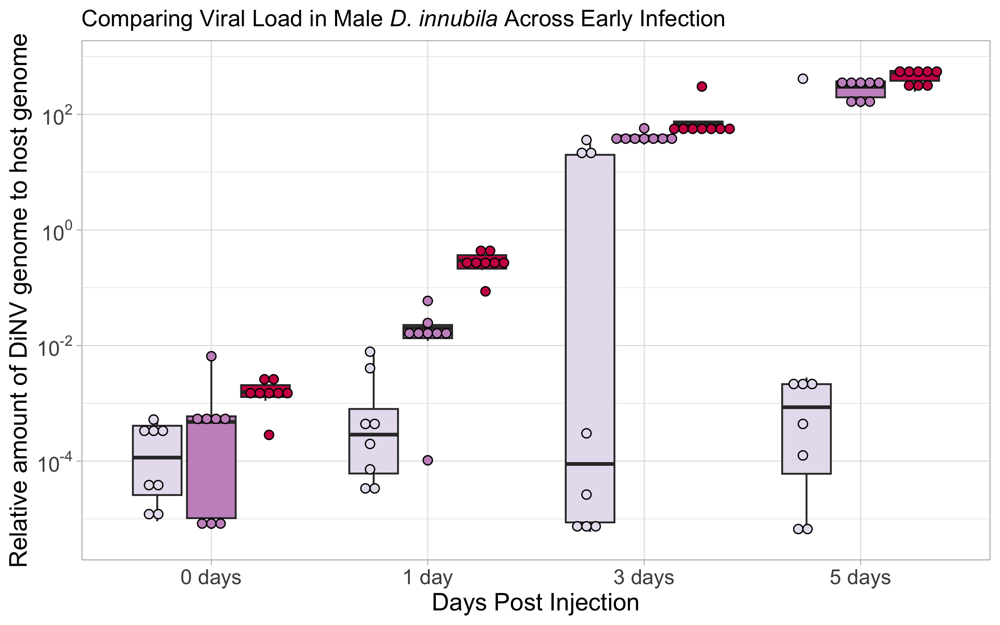
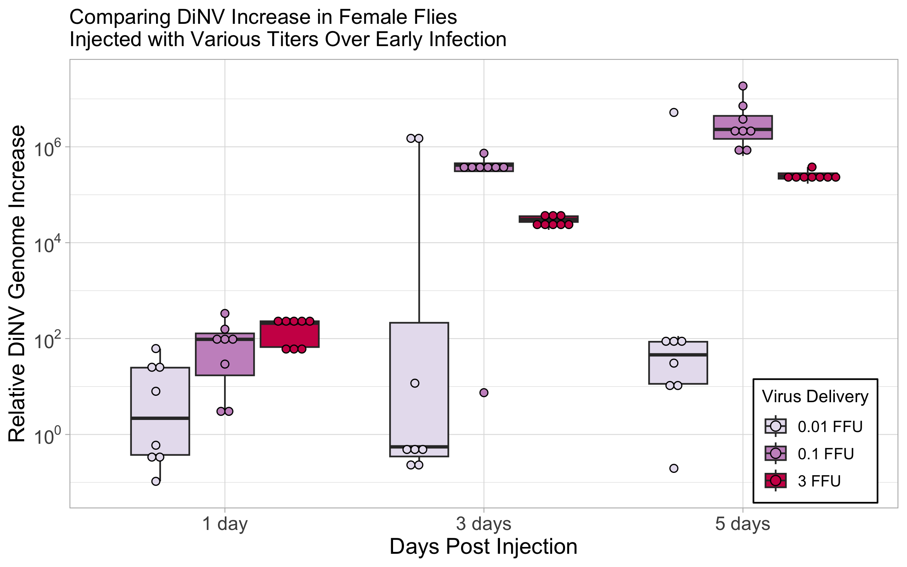
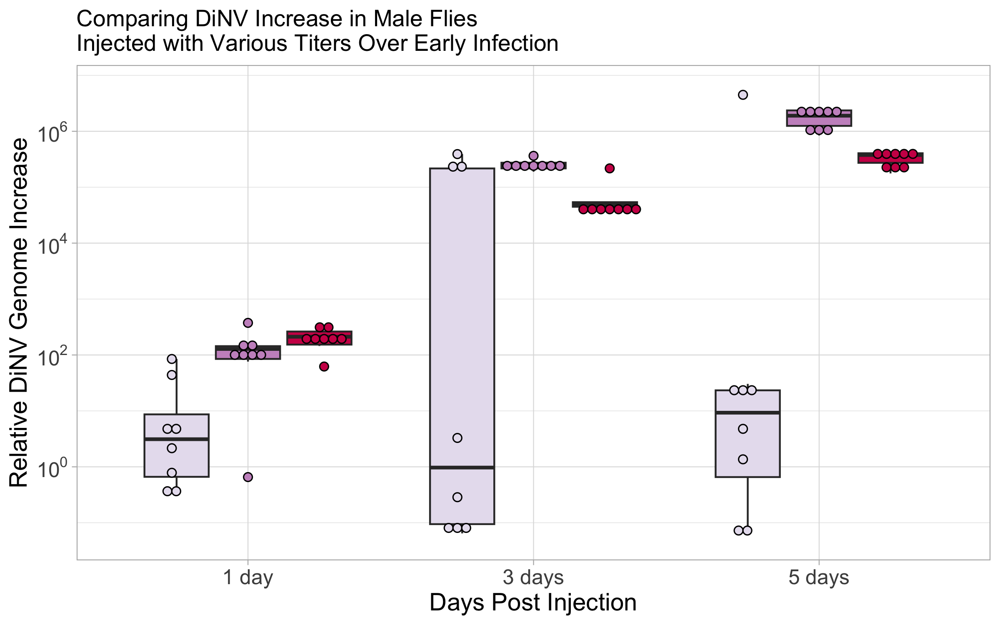
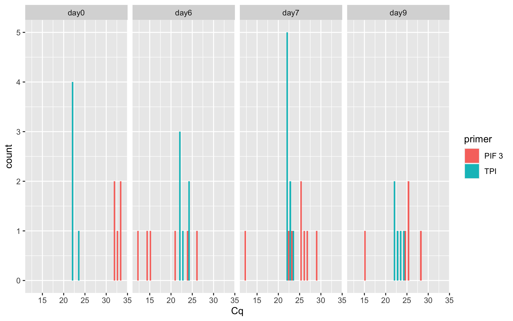
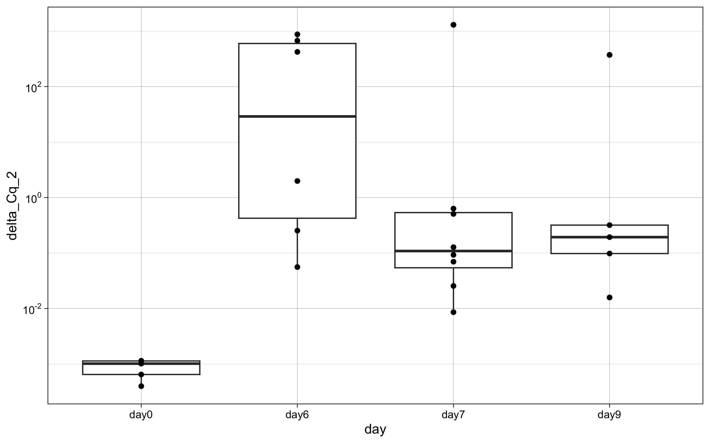
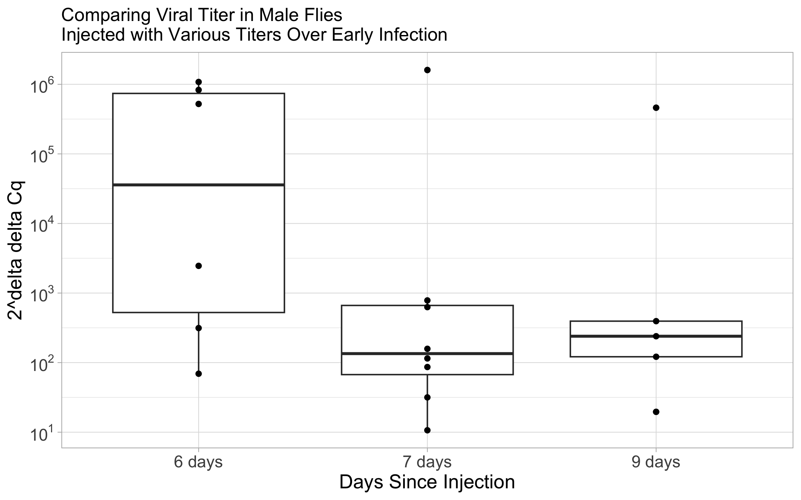
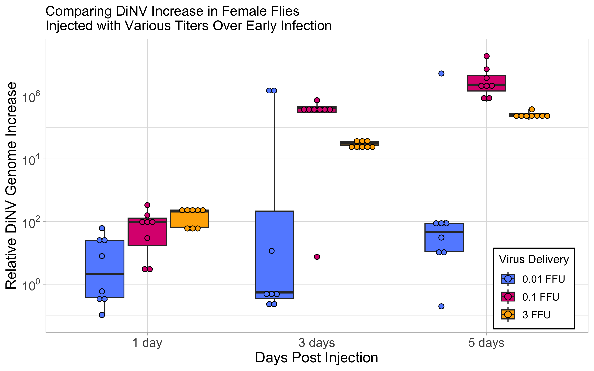

# p4-dilutions-time

``` r
library(ggplot2)
library(dplyr)
```


    Attaching package: 'dplyr'

    The following objects are masked from 'package:stats':

        filter, lag

    The following objects are masked from 'package:base':

        intersect, setdiff, setequal, union

``` r
library(tidyr)
library(scales)
library(Rmisc)
```

    Loading required package: lattice

    Loading required package: plyr

    ------------------------------------------------------------------------------

    You have loaded plyr after dplyr - this is likely to cause problems.
    If you need functions from both plyr and dplyr, please load plyr first, then dplyr:
    library(plyr); library(dplyr)

    ------------------------------------------------------------------------------


    Attaching package: 'plyr'

    The following objects are masked from 'package:dplyr':

        arrange, count, desc, failwith, id, mutate, rename, summarise,
        summarize

``` r
library(ggpubr)
```


    Attaching package: 'ggpubr'

    The following object is masked from 'package:plyr':

        mutate

``` r
library(rstatix)
```


    Attaching package: 'rstatix'

    The following objects are masked from 'package:plyr':

        desc, mutate

    The following object is masked from 'package:stats':

        filter

``` r
library(AICcmodavg)
library(ggtext)
```

Load in dataset

``` r
Cq_values <- read.csv("/Users/maggieschedl/Desktop/Github/Unckless_Lab_Resources/qPCR_analysis/20240228-viral-load-dilutions/viral-dil-time-sheet.csv")
```

Separate male and female for now

``` r
# males
Cq_values_M <- Cq_values[which(Cq_values$sex == "male"),]
# females
Cq_values_F <- Cq_values[which(Cq_values$sex == "female"),]
```

**Female Analysis First**

Look at raw Cq values

``` r
ggplot(Cq_values_F, aes(x= Cq, fill = primer)) + geom_histogram(position = "dodge") + facet_grid(~dilution) 
```

    `stat_bin()` using `bins = 30`. Pick better value with `binwidth`.


TPI looks remarkably consistant, PIF3 is all over the place but this
isn’t separated out by day which would make differences.

Look at raw Cq values and also separate by day

``` r
ggplot(Cq_values_F, aes(x= Cq, fill = primer)) + geom_histogram(position = "dodge") + facet_grid(dilution ~ day) 
```

    `stat_bin()` using `bins = 30`. Pick better value with `binwidth`.


This is showing more patterns that we sort of expect, but we have to do
the delta Cq comparison to the TPI primer to be sure

Calculating female delta Cq

``` r
# need to organize by name of the sample I think
Cq_values_F <- Cq_values_F[order(Cq_values_F$sample_ID),]
# this worked to order by the sample number 
# and the PIF3 value is first in the order and TPI second

# Separate that dataframe, incriminating by 2, every number between 1-192 (number of rows in dataframe)
Cq_values_F$Cq[seq(1,192,2)] # these are the PIF 3 Cq #s
```

     [1] 33.59 40.00 38.10 36.14 40.00 34.42 33.56 34.52 40.00 36.20 39.46 40.00
    [13] 40.00 40.00 34.57 34.96 32.03 32.65 31.64 32.01 30.90 32.08 32.00 31.57
    [25] 40.00 40.00 40.00 33.89 34.98 40.00 33.19 31.65 29.66 35.08 28.85 30.04
    [37] 29.02 31.12 29.99 27.43 24.44 25.01 24.42 26.80 23.84 26.54 26.27 24.20
    [49] 38.80 40.00 18.21 17.55 38.61 40.00 40.00 35.00 17.14 17.30 17.16 17.37
    [61] 17.01 17.44 17.20 33.49 16.49 17.15 16.77 16.93 16.93 17.10 16.58 17.02
    [73] 16.04 32.46 31.36 31.55 34.14 32.49 34.70 40.00 16.17 15.59 13.96 15.19
    [85] 11.42 15.47 15.21 15.93 14.74 15.25 14.71 13.93 15.95 14.81 15.77 14.36

``` r
Cq_values_F$Cq[seq(2,192,2)] # these are the TPI primer Cq #s 
```

     [1] 22.86 23.12 23.74 23.17 23.09 22.81 22.67 21.78 23.26 22.09 23.69 23.18
    [13] 21.89 22.69 22.76 22.01 22.84 23.02 22.97 23.01 22.23 22.26 22.63 21.85
    [25] 23.28 23.80 22.68 23.15 22.52 21.30 22.34 22.15 23.18 23.14 22.76 18.41
    [37] 22.52 22.61 22.90 22.43 22.81 23.82 22.99 23.53 22.37 23.04 23.09 22.84
    [49] 22.68 22.67 23.06 22.83 22.11 22.20 23.14 23.10 23.24 22.75 22.55 22.73
    [61] 22.20 22.24 22.07 23.00 22.35 22.80 22.72 22.57 22.53 22.02 22.46 22.08
    [73] 22.90 23.10 22.73 22.39 22.31 21.98 22.41 22.20 22.08 22.31 23.34 22.63
    [85] 22.18 23.93 23.27 23.15 24.01 23.48 23.73 22.62 24.49 23.41 23.89 23.14

``` r
# make the delta Cq by subtracting the PIF 3 values from the TPI primer values
# and this is saved as a vector in R 
delta_Cqs_F <- Cq_values_F$Cq[seq(2,192,2)] - Cq_values_F$Cq[seq(1,192,2)]
#vector
delta_Cqs_F
```

     [1] -10.73 -16.88 -14.36 -12.97 -16.91 -11.61 -10.89 -12.74 -16.74 -14.11
    [11] -15.77 -16.82 -18.11 -17.31 -11.81 -12.95  -9.19  -9.63  -8.67  -9.00
    [21]  -8.67  -9.82  -9.37  -9.72 -16.72 -16.20 -17.32 -10.74 -12.46 -18.70
    [31] -10.85  -9.50  -6.48 -11.94  -6.09 -11.63  -6.50  -8.51  -7.09  -5.00
    [41]  -1.63  -1.19  -1.43  -3.27  -1.47  -3.50  -3.18  -1.36 -16.12 -17.33
    [51]   4.85   5.28 -16.50 -17.80 -16.86 -11.90   6.10   5.45   5.39   5.36
    [61]   5.19   4.80   4.87 -10.49   5.86   5.65   5.95   5.64   5.60   4.92
    [71]   5.88   5.06   6.86  -9.36  -8.63  -9.16 -11.83 -10.51 -12.29 -17.80
    [81]   5.91   6.72   9.38   7.44  10.76   8.46   8.06   7.22   9.27   8.23
    [91]   9.02   8.69   8.54   8.60   8.12   8.78

``` r
# Make a new dataframe that only has one row per sample by getting rid of the rows with the TPI primer
Cq_values_F_Delta <- Cq_values_F[which(Cq_values_F$primer == "PIF3"),]

# And then add in the delta Cqs as a new column
Cq_values_F_Delta$delta_Cq <- delta_Cqs_F

# add a column with 2^ delta Cq
Cq_values_F_Delta$delta_Cq_2 <- 2^(delta_Cqs_F)
```

Plot 2^delta Cq

``` r
ledgend_title = "Virus Delivery"
ggplot(Cq_values_F_Delta, aes(y= delta_Cq_2, x=day)) +
  geom_boxplot(outlier.shape=NA, aes(fill=dilution))  + 
  theme_light() + scale_fill_manual(ledgend_title, values=c("#E7E1EF", "#C994C7", "#CE1256")) + 
  geom_dotplot(aes(fill=dilution), binaxis='y', stackdir='center', dotsize=0.6, position=position_dodge(0.8)) + 
  scale_y_continuous(trans='log10', breaks=trans_breaks('log10', function(x) 10^x), labels=trans_format('log10', math_format(10^.x))) + 
  theme(axis.text=element_text(size=12),axis.title=element_text(size=14), legend.text=element_text(size=6), legend.title=element_text(size=7)) +
  scale_x_discrete(labels=c("day0" = "0 days", "day1" = "1 day", "day3" = "3 days", "day5" = "5 days")) + 
  labs(title = "Comparing Viral Load in Female _D. innubila_ Across Early Infection",y = "Relative amount of DiNV genome to host genome", x = "Days Post Injection") +
  theme(legend.position = c(0.93, 0.15), legend.background = element_rect(linetype="solid", colour ="black"),plot.title = element_markdown())
```

    Bin width defaults to 1/30 of the range of the data. Pick better value with
    `binwidth`.


**Male Analysis Second**

Look at raw Cq values and also separate by day

``` r
ggplot(Cq_values_M, aes(x= Cq, fill = primer)) + geom_histogram(position = "dodge") + facet_grid(dilution ~ day) 
```

    `stat_bin()` using `bins = 30`. Pick better value with `binwidth`.

    Warning: Removed 1 rows containing non-finite values (`stat_bin()`).


Looks pretty similar to the female results

Calculating male delta Cq

``` r
# need to organize by name of the sample I think
Cq_values_M <- Cq_values_M[order(Cq_values_M$sample_ID),]
# this worked to order by the sample number 
# and the PIF3 value is first in the order and TPI second

# notice that there is one NA in the data that I forgot to set as 40 for the Cq 

Cq_values_M[is.na(Cq_values_M)] <- 40

# Separate that dataframe, incriminating by 2, every number between 1-192 (number of rows in dataframe)
Cq_values_M$Cq[seq(1,192,2)] # these are the PIF 3 Cq #s
```

     [1] 34.14 34.15 40.00 40.00 29.40 34.72 33.92 40.00 35.93 35.11 37.72 34.82
    [13] 40.00 38.02 40.00 34.85 32.04 34.93 31.41 32.21 32.02 32.54 32.56 32.56
    [25] 31.76 35.16 34.20 38.38 29.97 37.50 35.51 36.84 28.89 29.57 27.49 28.79
    [37] 36.25 29.44 29.15 28.12 26.26 24.84 24.82 25.54 25.16 25.04 25.66 26.10
    [49] 38.36 40.00 40.00 18.41 18.85 40.00 18.26 35.08 18.06 18.06 18.29 17.39
    [61] 17.40 17.04 17.97 17.14 17.40 17.85 17.35 16.56 17.24 16.66 14.25 16.71
    [73] 32.73 36.16 32.04 32.10 13.48 40.00 40.00 34.78 16.24 17.15 15.26 15.58
    [85] 15.12 14.31 14.33 16.16 15.29 15.41 14.09 14.06 15.29 14.57 13.87 14.53

``` r
Cq_values_M$Cq[seq(2,192,2)] # these are the TPI primer Cq #s 
```

     [1] 23.41 23.09 23.44 22.81 22.14 24.06 22.91 23.42 25.03 23.87 23.40 23.56
    [13] 23.25 23.01 24.08 23.00 23.10 23.15 23.10 23.35 22.68 22.72 23.03 23.24
    [25] 23.81 23.93 23.13 23.39 22.97 22.78 23.21 23.08 23.39 23.89 23.41 23.21
    [37] 23.01 23.06 22.98 22.77 24.06 23.37 23.81 24.15 23.27 23.41 23.35 22.57
    [49] 23.15 23.29 22.89 23.05 23.06 22.64 23.43 23.39 23.17 23.11 23.19 22.77
    [61] 22.71 22.63 23.26 22.98 23.47 23.81 22.73 22.80 23.47 22.62 22.49 22.87
    [73] 23.74 23.20 23.56 22.87 22.17 22.80 22.82 23.63 23.29 24.53 22.96 23.84
    [85] 23.75 23.04 22.84 24.35 23.95 23.71 23.26 23.09 24.33 22.51 23.04 23.66

``` r
# make the delta Cq by subtracting the PIF 3 values from the TPI primer values
# and this is saved as a vector in R 
delta_Cqs_M <- Cq_values_M$Cq[seq(2,192,2)] - Cq_values_M$Cq[seq(1,192,2)]
#vector
delta_Cqs_M
```

     [1] -10.73 -11.06 -16.56 -17.19  -7.26 -10.66 -11.01 -16.58 -10.90 -11.24
    [11] -14.32 -11.26 -16.75 -15.01 -15.92 -11.85  -8.94 -11.78  -8.31  -8.86
    [21]  -9.34  -9.82  -9.53  -9.32  -7.95 -11.23 -11.07 -14.99  -7.00 -14.72
    [31] -12.30 -13.76  -5.50  -5.68  -4.08  -5.58 -13.24  -6.38  -6.17  -5.35
    [41]  -2.20  -1.47  -1.01  -1.39  -1.89  -1.63  -2.31  -3.53 -15.21 -16.71
    [51] -17.11   4.64   4.21 -17.36   5.17 -11.69   5.11   5.05   4.90   5.38
    [61]   5.31   5.59   5.29   5.84   6.07   5.96   5.38   6.24   6.23   5.96
    [71]   8.24   6.16  -8.99 -12.96  -8.48  -9.23   8.69 -17.20 -17.18 -11.15
    [81]   7.05   7.38   7.70   8.26   8.63   8.73   8.51   8.19   8.66   8.30
    [91]   9.17   9.03   9.04   7.94   9.17   9.13

``` r
# Make a new dataframe that only has one row per sample by getting rid of the rows with the TPI primer
Cq_values_M_Delta <- Cq_values_M[which(Cq_values_M$primer == "PIF3"),]

# And then add in the delta Cqs as a new column
Cq_values_M_Delta$delta_Cq <- delta_Cqs_M

# add a column with 2^ delta Cq
Cq_values_M_Delta$delta_Cq_2 <- 2^(delta_Cqs_M)
```

Plot 2^delta Cq

``` r
ggplot(Cq_values_M_Delta, aes(y= delta_Cq_2, x=day)) +
  geom_boxplot(outlier.shape=NA, aes(fill=dilution))  + 
  theme_light() + scale_fill_manual(ledgend_title, values=c("#E7E1EF", "#C994C7", "#CE1256")) + 
  geom_dotplot(aes(fill=dilution), binaxis='y', stackdir='center', dotsize=0.6, position=position_dodge(0.8)) + 
  scale_y_continuous(trans='log10', breaks=trans_breaks('log10', function(x) 10^x), labels=trans_format('log10', math_format(10^.x))) + 
  theme(axis.text=element_text(size=12),axis.title=element_text(size=14), legend.text=element_text(size=6), legend.title=element_text(size=7)) +
  scale_x_discrete(labels=c("day0" = "0 days", "day1" = "1 day", "day3" = "3 days", "day5" = "5 days")) + 
  labs(title = expression("Comparing Viral Load in Male _D. innubila_ Across Early Infection"),y = "Relative amount of DiNV genome to host genome", x = "Days Post Injection") +
  theme(legend.position = "none",
        plot.title = element_markdown())
```

    Bin width defaults to 1/30 of the range of the data. Pick better value with
    `binwidth`.



**Delta Delta Analysis**

Females

``` r
# this might be a little mess to do 
# separate out the day 0 samples to start with 
F_0 <- Cq_values_F_Delta[which(Cq_values_F_Delta$day == "day0"),]
# separate out dilutions?
F_0_3 <- F_0[which(F_0$dilution == "3 FFU"),]
# find mean of Delta Cq (not 2^delta)
mean(F_0_3$delta_Cq)
```

    [1] -9.25875

``` r
# -9.25875
F_0_01 <- F_0[which(F_0$dilution == "0.1 FFU"),]
# find mean of Delta Cq (not 2^delta)
mean(F_0_01$delta_Cq)
```

    [1] -13.38625

``` r
# -13.38625
F_0_001 <- F_0[which(F_0$dilution == "0.01 FFU"),]
# find mean of Delta Cq (not 2^delta)
mean(F_0_001$delta_Cq)
```

    [1] -15.4525

``` r
# -15.4525

# main data sheet without day 0 
F <- Cq_values_F_Delta[which(Cq_values_F_Delta$day != "day0"),]
# separate out just dilution 3 
F_3 <- F[which(F$dilution == "3 FFU"),]

# subtract average day 0 delta Cq for 3 FFU from the delta Cq of all others 
delta_delta_3 <- F_3$delta_Cq - -9.25875
delta_delta_3
```

     [1]  7.62875  8.06875  7.82875  5.98875  7.78875  5.75875  6.07875  7.89875
     [9] 15.11875 14.90875 15.20875 14.89875 14.85875 14.17875 15.13875 14.31875
    [17] 18.52875 17.48875 18.27875 17.94875 17.79875 17.85875 17.37875 18.03875

``` r
# add as column 
F_3$delta_delta_Cq <- delta_delta_3

# do 2^ delta delta 
F_3$delta_delta_Cq_2 <- 2^(delta_delta_3)

# separate out just dilution 0.1 
F_01 <- F[which(F$dilution == "0.1 FFU"),]

# subtract average day 0 delta Cq for 3 FFU from the delta Cq of all others 
delta_delta_01 <- F_01$delta_Cq - -13.38625
delta_delta_01
```

     [1]  6.90625  1.44625  7.29625  1.75625  6.88625  4.87625  6.29625  8.38625
     [9] 19.48625 18.83625 18.77625 18.74625 18.57625 18.18625 18.25625  2.89625
    [17] 19.29625 20.10625 22.76625 20.82625 24.14625 21.84625 21.44625 20.60625

``` r
# add as column 
F_01$delta_delta_Cq <- delta_delta_01

# do 2^ delta delta 
F_01$delta_delta_Cq_2 <- 2^(delta_delta_01)

# separate out just dilution 0.01 
F_001 <- F[which(F$dilution == "0.01 FFU"),]

# subtract average day 0 delta Cq for 3 FFU from the delta Cq of all others 
delta_delta_001 <- F_001$delta_Cq - -15.4525
delta_delta_001
```

     [1] -1.2675 -0.7475 -1.8675  4.7125  2.9925 -3.2475  4.6025  5.9525 -0.6675
    [10] -1.8775 20.3025 20.7325 -1.0475 -2.3475 -1.4075  3.5525 22.3125  6.0925
    [19]  6.8225  6.2925  3.6225  4.9425  3.1625 -2.3475

``` r
# add as column 
F_001$delta_delta_Cq <- delta_delta_001

# do 2^ delta delta 
F_001$delta_delta_Cq_2 <- 2^(delta_delta_001)

# add all of the days back together 
Female_delta_delta <- rbind(F_001, F_01, F_3)
```

Doing linear models for statistical tests Female use delta delta Cq

``` r
# make a dilution column that is numeric
Female_delta_delta$numeric.dilution <- as.numeric(gsub(" FFU", "", Female_delta_delta$dilution))
# make a day column that is numeric
Female_delta_delta$numeric.day <- as.numeric(gsub("day", "", Female_delta_delta$day))

# linear model 
# do stats on just the delta delta Cq, not the 2^ transformed 
female_full_model <- lm(delta_delta_Cq~numeric.dilution*numeric.day, data = Female_delta_delta)
summary(aov(female_full_model))
```

                                 Df Sum Sq Mean Sq F value   Pr(>F)    
    numeric.dilution              1  281.7   281.7   6.350   0.0141 *  
    numeric.day                   1 1336.1  1336.1  30.113 6.52e-07 ***
    numeric.dilution:numeric.day  1    1.0     1.0   0.022   0.8834    
    Residuals                    68 3017.0    44.4                     
    ---
    Signif. codes:  0 '***' 0.001 '**' 0.01 '*' 0.05 '.' 0.1 ' ' 1

``` r
# no interaction 
female_full_modelni <- lm(delta_delta_Cq~numeric.dilution+numeric.day, data = Female_delta_delta)
summary(aov(female_full_modelni))
```

                     Df Sum Sq Mean Sq F value   Pr(>F)    
    numeric.dilution  1  281.7   281.7   6.442   0.0134 *  
    numeric.day       1 1336.1  1336.1  30.547 5.41e-07 ***
    Residuals        69 3017.9    43.7                     
    ---
    Signif. codes:  0 '***' 0.001 '**' 0.01 '*' 0.05 '.' 0.1 ' ' 1

``` r
modelsF <- list(female_full_model, female_full_modelni)

model.namesF <- c( ' dilution day interaction', 'dilution day')

aictab(cand.set = modelsF, modnames = model.namesF)
```


    Model selection based on AICc:

                              K   AICc Delta_AICc AICcWt Cum.Wt      LL
    dilution day              4 481.89       0.00   0.76   0.76 -236.65
     dilution day interaction 5 484.18       2.29   0.24   1.00 -236.64

``` r
# no interaction model female_delta_full_modelni is the best 
summary(female_full_modelni)
```


    Call:
    lm(formula = delta_delta_Cq ~ numeric.dilution + numeric.day, 
        data = Female_delta_delta)

    Residuals:
         Min       1Q   Median       3Q      Max 
    -16.8125  -3.1117  -0.1493   4.4343  11.5433 

    Coefficients:
                     Estimate Std. Error t value Pr(>|t|)    
    (Intercept)        1.2612     1.7310   0.729   0.4687    
    numeric.dilution   1.4244     0.5612   2.538   0.0134 *  
    numeric.day        2.6379     0.4773   5.527 5.41e-07 ***
    ---
    Signif. codes:  0 '***' 0.001 '**' 0.01 '*' 0.05 '.' 0.1 ' ' 1

    Residual standard error: 6.613 on 69 degrees of freedom
    Multiple R-squared:  0.349, Adjusted R-squared:  0.3301 
    F-statistic: 18.49 on 2 and 69 DF,  p-value: 3.706e-07

``` r
# look at just 0.01 FFU dilution 
female_001_model <- lm(delta_delta_Cq~numeric.day, data = subset(Female_delta_delta, numeric.dilution == "0.01"))
summary(aov(female_001_model))
```

                Df Sum Sq Mean Sq F value Pr(>F)
    numeric.day  1   98.9   98.85   1.915   0.18
    Residuals   22 1135.9   51.63               

Plot box plots

``` r
legend_title <- "Virus Delivery"
ggplot(Female_delta_delta, aes(y= delta_delta_Cq_2, x=day)) + geom_boxplot(outlier.shape=NA,aes(fill=dilution)) +  
  scale_fill_manual(legend_title, values=c("#E7E1EF", "#C994C7", "#CE1256")) + 
  theme_light() + 
  geom_dotplot(binaxis='y', stackdir='center', dotsize=0.6, position=position_dodge(0.8),aes(fill=dilution)) + 
  scale_y_continuous(trans='log10', breaks=trans_breaks('log10', function(x) 10^x), labels=trans_format('log10', math_format(10^.x))) + 
  theme(axis.text=element_text(size=12),axis.title=element_text(size=14), legend.text=element_text(size=10), legend.title=element_text(size=11)) +
  scale_x_discrete(labels=c("day1" = "1 day", "day3" = "3 days", "day5" = "5 days")) +
  labs(title = "Comparing DiNV Increase in Female Flies \nInjected with Various Titers Over Early Infection",y = "Relative DiNV Genome Increase", x = "Days Post Injection") +
  theme(legend.position = c(0.9, 0.15), legend.background = element_rect(linetype="solid", colour ="black")) 
```

    Bin width defaults to 1/30 of the range of the data. Pick better value with
    `binwidth`.



Males Calculate delta delta Cq

``` r
# this might be a little mess to do 
# separate out the day 0 samples to start with 
M_0 <- Cq_values_M_Delta[which(Cq_values_M_Delta$day == "day0"),]
# separate out dilutions?
M_0_3 <- M_0[which(M_0$dilution == "3 FFU"),]
# find mean of Delta Cq (not 2^delta)
mean(M_0_3$delta_Cq)
```

    [1] -9.4875

``` r
# -9.4875
M_0_01 <- M_0[which(M_0$dilution == "0.1 FFU"),]
# find mean of Delta Cq (not 2^delta)
mean(M_0_01$delta_Cq)
```

    [1] -12.63125

``` r
# -12.63125
M_0_001 <- M_0[which(M_0$dilution == "0.01 FFU"),]
# find mean of Delta Cq (not 2^delta)
mean(M_0_001$delta_Cq)
```

    [1] -13.40625

``` r
# -13.40625

# main data sheet without day 0 
M <- Cq_values_M_Delta[which(Cq_values_M_Delta$day != "day0"),]
# separate out just dilution 3 
M_3 <- M[which(M$dilution == "3 FFU"),]

# subtract average day 0 delta Cq for 3 FFU from the delta Cq of all others 
delta_delta_3_M <- M_3$delta_Cq - -9.4875
delta_delta_3_M
```

     [1]  7.2875  8.0175  8.4775  8.0975  7.5975  7.8575  7.1775  5.9575 15.5575
    [10] 15.4475 14.8675 15.7275 15.7175 15.4475 17.7275 15.6475 18.1475 17.7875
    [19] 18.6575 18.5175 18.5275 17.4275 18.6575 18.6175

``` r
# add as column 
M_3$delta_delta_Cq <- delta_delta_3_M

# do 2^ delta delta 
M_3$delta_delta_Cq_2 <- 2^(delta_delta_3_M)

# separate out just dilution 0.1 
M_01 <- M[which(M$dilution == "0.1 FFU"),]

# subtract average day 0 delta Cq for 3 FFU from the delta Cq of all others 
delta_delta_01_M <- M_01$delta_Cq - -12.63125
delta_delta_01_M
```

     [1]  7.13125  6.95125  8.55125  7.05125 -0.60875  6.25125  6.46125  7.28125
     [9] 17.74125 17.68125 17.53125 18.01125 17.94125 18.22125 17.92125 18.47125
    [17] 19.68125 20.01125 20.33125 20.89125 21.26125 21.36125 21.14125 20.82125

``` r
# add as column 
M_01$delta_delta_Cq <- delta_delta_01_M

# do 2^ delta delta 
M_01$delta_delta_Cq_2 <- 2^(delta_delta_01_M)

# separate out just dilution 0.01 
M_001 <- M[which(M$dilution == "0.01 FFU"),]

# subtract average day 0 delta Cq for 3 FFU from the delta Cq of all others 
delta_delta_001_M <- M_001$delta_Cq - -13.40625
delta_delta_001_M
```

     [1]  5.45625  2.17625  2.33625 -1.58375  6.40625 -1.31375  1.10625 -0.35375
     [9] -1.80375 -3.30375 -3.70375 18.04625 17.61625 -3.95375 18.57625  1.71625
    [17]  4.41625  0.44625  4.92625  4.17625 22.09625 -3.79375 -3.77375  2.25625

``` r
# add as column 
M_001$delta_delta_Cq <- delta_delta_001_M

# do 2^ delta delta 
M_001$delta_delta_Cq_2 <- 2^(delta_delta_001_M)

# add all of the days back together 
Male_delta_delta <- rbind(M_001, M_01, M_3)
```

Doing linear models for statistical tests Male

``` r
# make a dilution column that is numeric
Male_delta_delta$numeric.dilution <- as.numeric(gsub(" FFU", "", Male_delta_delta$dilution))
# make a day column that is numeric
Male_delta_delta$numeric.day <- as.numeric(gsub("day", "", Male_delta_delta$day))

# linear model 
# do stats on just the delta delta Cq, not the 2^ transformed 
male_full_model <- lm(delta_delta_Cq~numeric.dilution*numeric.day, data = Male_delta_delta)
summary(aov(male_full_model))
```

                                 Df Sum Sq Mean Sq F value   Pr(>F)    
    numeric.dilution              1    374   373.6   7.548  0.00768 ** 
    numeric.day                   1    998   997.5  20.155 2.83e-05 ***
    numeric.dilution:numeric.day  1     20    19.6   0.396  0.53148    
    Residuals                    68   3366    49.5                     
    ---
    Signif. codes:  0 '***' 0.001 '**' 0.01 '*' 0.05 '.' 0.1 ' ' 1

``` r
# no interaction 
male_full_modelni <- lm(delta_delta_Cq~numeric.dilution+numeric.day, data = Male_delta_delta)
summary(aov(male_full_modelni))
```

                     Df Sum Sq Mean Sq F value   Pr(>F)    
    numeric.dilution  1    374   373.6   7.614  0.00741 ** 
    numeric.day       1    998   997.5  20.333 2.59e-05 ***
    Residuals        69   3385    49.1                     
    ---
    Signif. codes:  0 '***' 0.001 '**' 0.01 '*' 0.05 '.' 0.1 ' ' 1

``` r
modelsM <- list(male_full_model, male_full_modelni)

model.namesM <- c( ' dilution day interaction', 'dilution day')

aictab(cand.set = modelsM, modnames = model.namesM)
```


    Model selection based on AICc:

                              K   AICc Delta_AICc AICcWt Cum.Wt      LL
    dilution day              4 490.16       0.00   0.72   0.72 -240.78
     dilution day interaction 5 492.05       1.89   0.28   1.00 -240.57

``` r
# no interaction model is the best
summary(male_full_modelni)
```


    Call:
    lm(formula = delta_delta_Cq ~ numeric.dilution + numeric.day, 
        data = Male_delta_delta)

    Residuals:
         Min       1Q   Median       3Q      Max 
    -17.4910  -2.6710   0.8508   6.2464   9.4378 

    Coefficients:
                     Estimate Std. Error t value Pr(>|t|)    
    (Intercept)        2.2840     1.8332   1.246  0.21703    
    numeric.dilution   1.6401     0.5944   2.759  0.00741 ** 
    numeric.day        2.2794     0.5055   4.509 2.59e-05 ***
    ---
    Signif. codes:  0 '***' 0.001 '**' 0.01 '*' 0.05 '.' 0.1 ' ' 1

    Residual standard error: 7.004 on 69 degrees of freedom
    Multiple R-squared:  0.2883,    Adjusted R-squared:  0.2676 
    F-statistic: 13.97 on 2 and 69 DF,  p-value: 8.031e-06

``` r
# look at just 0.01 FFU dilution 
Male_001_model <- lm(delta_delta_Cq~numeric.day, data = subset(Male_delta_delta, numeric.dilution == "0.01"))
summary(aov(Male_001_model))
```

                Df Sum Sq Mean Sq F value Pr(>F)
    numeric.day  1   17.1   17.06   0.277  0.604
    Residuals   22 1356.5   61.66               

Plot box plots

``` r
legend_title <- "Virus Delivery"
ggplot(Male_delta_delta, aes(y= delta_delta_Cq_2, x=day)) + geom_boxplot(outlier.shape=NA,aes(fill=dilution)) +  
  scale_fill_manual(legend_title, values=c("#E7E1EF", "#C994C7", "#CE1256")) + 
  theme_light() + 
  geom_dotplot(binaxis='y', stackdir='center', dotsize=0.6, position=position_dodge(0.8),aes(fill=dilution)) + 
  scale_y_continuous(trans='log10', breaks=trans_breaks('log10', function(x) 10^x), labels=trans_format('log10', math_format(10^.x))) + 
  theme(axis.text=element_text(size=12),axis.title=element_text(size=14), legend.text=element_text(size=10), legend.title=element_text(size=11)) +
  scale_x_discrete(labels=c("day1" = "1 day", "day3" = "3 days", "day5" = "5 days")) +
  labs(title = "Comparing DiNV Increase in Male Flies \nInjected with Various Titers Over Early Infection",y = "Relative DiNV Genome Increase", x = "Days Post Injection") +
  theme(legend.position = "none")
```

    Bin width defaults to 1/30 of the range of the data. Pick better value with
    `binwidth`.



Combine males and females and look at a linear model considering all for
the delta delta Cq

``` r
all_data <- rbind(Female_delta_delta, Male_delta_delta)

# model with interaction between day, dilution and sex
full_model_int <- lm(delta_delta_Cq~numeric.dilution*numeric.day*sex, data = all_data)
summary(aov(full_model_int))
```

                                      Df Sum Sq Mean Sq F value   Pr(>F)    
    numeric.dilution                   1    652   652.1  13.894 0.000283 ***
    numeric.day                        1   2321  2321.3  49.462 8.96e-11 ***
    sex                                1      1     1.1   0.022 0.881284    
    numeric.dilution:numeric.day       1     15    14.6   0.311 0.577826    
    numeric.dilution:sex               1      3     3.2   0.069 0.793378    
    numeric.day:sex                    1     12    12.3   0.263 0.608922    
    numeric.dilution:numeric.day:sex   1      6     5.9   0.126 0.722725    
    Residuals                        136   6383    46.9                     
    ---
    Signif. codes:  0 '***' 0.001 '**' 0.01 '*' 0.05 '.' 0.1 ' ' 1

``` r
# model with interaction between day and dilution, but not sex
full_model_nsint <- lm(delta_delta_Cq~numeric.dilution*numeric.day + sex, data = all_data)
summary(aov(full_model_nsint))
```

                                  Df Sum Sq Mean Sq F value   Pr(>F)    
    numeric.dilution               1    652   652.1  14.153 0.000248 ***
    numeric.day                    1   2321  2321.3  50.383 5.93e-11 ***
    sex                            1      1     1.1   0.023 0.880187    
    numeric.dilution:numeric.day   1     15    14.6   0.317 0.574289    
    Residuals                    139   6404    46.1                     
    ---
    Signif. codes:  0 '***' 0.001 '**' 0.01 '*' 0.05 '.' 0.1 ' ' 1

``` r
# model with interaction between day and dilution, and model not including sex 
full_model_ns <- lm(delta_delta_Cq~numeric.dilution*numeric.day, data = all_data)
summary(aov(full_model_ns))
```

                                  Df Sum Sq Mean Sq F value   Pr(>F)    
    numeric.dilution               1    652   652.1  14.253 0.000235 ***
    numeric.day                    1   2321  2321.3  50.737 5.08e-11 ***
    numeric.dilution:numeric.day   1     15    14.6   0.319 0.572942    
    Residuals                    140   6405    45.8                     
    ---
    Signif. codes:  0 '***' 0.001 '**' 0.01 '*' 0.05 '.' 0.1 ' ' 1

``` r
# try special package for comparing AIC 
models <- list( full_model_ns, full_model_nsint, full_model_int)

model.names <- c( 'model without sex', 'model without sex as interaction', 'full model')

aictab(cand.set = models, modnames = model.names)
```


    Model selection based on AICc:

                                     K   AICc Delta_AICc AICcWt Cum.Wt      LL
    model without sex                5 965.57       0.00   0.74   0.74 -477.57
    model without sex as interaction 6 967.73       2.15   0.25   0.99 -477.56
    full model                       9 973.97       8.40   0.01   1.00 -477.32

``` r
# model without sex is the best fit 
```

Look at male and female for each dilution by day

3 FFU dilution

``` r
# male
M_3_dil <- Male_delta_delta[which(Male_delta_delta$dilution == "3 FFU"),]
# female
F_3_dil <- Female_delta_delta[which(Female_delta_delta$dilution == "3 FFU"),]

FFU_3_dil <- rbind(M_3_dil, F_3_dil)


legend_title = "Sex"
#Plot 
ggplot(FFU_3_dil, aes(y= delta_delta_Cq_2, x=day, fill=sex)) + 
  geom_boxplot()  + 
  scale_fill_manual(legend_title, values=c("#E7298A" ,  "#67001F")) +
  theme_light() + 
  geom_dotplot(binaxis='y', stackdir='center', dotsize=0.75, position=position_dodge(0.8)) + 
  scale_y_continuous(trans='log10', breaks=trans_breaks('log10', function(x) 10^x), labels=trans_format('log10', math_format(10^.x))) +
  scale_x_discrete(labels=c("day1" = "1 day", "day3" = "3 days", "day5" = "5 days")) +
  theme(axis.text=element_text(size=12),axis.title=element_text(size=14), legend.text=element_text(size=11), legend.title=element_text(size=12)) +
  theme(legend.position = c(0.9, 0.2), legend.background = element_rect(linetype="solid", colour ="black")) +
  labs(title = "Comparing DiNV Increase in Male and Female Flies \nInjected with 3 FFU DiNV Over Early Infection",y = "Relative DiNV Genome Increase", x = "Days Post Injection")
```

    Bin width defaults to 1/30 of the range of the data. Pick better value with
    `binwidth`.


0.1 FFU dilution

``` r
# male
M_01_dil <- Male_delta_delta[which(Male_delta_delta$dilution == "0.1 FFU"),]
# female
F_01_dil <- Female_delta_delta[which(Female_delta_delta$dilution == "0.1 FFU"),]

FFU_01_dil <- rbind(M_01_dil, F_01_dil)


legend_title = "Sex"
#Plot 
ggplot(FFU_01_dil, aes(y= delta_delta_Cq_2, x=day, fill=sex)) + 
  geom_boxplot()  + 
  scale_fill_manual(legend_title, values=c("#E7298A" ,  "#67001F")) +
  theme_light() + 
  geom_dotplot(binaxis='y', stackdir='center', dotsize=0.75, position=position_dodge(0.8)) + 
  scale_y_continuous(trans='log10', breaks=trans_breaks('log10', function(x) 10^x), labels=trans_format('log10', math_format(10^.x))) +
  scale_x_discrete(labels=c("day1" = "1 day", "day3" = "3 days", "day5" = "5 days")) +
  theme(axis.text=element_text(size=12),axis.title=element_text(size=14), legend.text=element_text(size=11), legend.title=element_text(size=12)) +
  theme(legend.position = "none") +
  labs(title = "Comparing DiNV Increase in Male and Female Flies \nInjected with 0.1 FFU DiNV Over Early Infection",y = "Relative DiNV Genome Increase", x = "Days Post Injection")
```

    Bin width defaults to 1/30 of the range of the data. Pick better value with
    `binwidth`.


0.01 FFU dilution

``` r
# male
M_001_dil <- Male_delta_delta[which(Male_delta_delta$dilution == "0.01 FFU"),]
# female
F_001_dil <- Female_delta_delta[which(Female_delta_delta$dilution == "0.01 FFU"),]

FFU_001_dil <- rbind(M_001_dil, F_001_dil)


legend_title = "Sex"
#Plot 
ggplot(FFU_001_dil, aes(y= delta_delta_Cq_2, x=day, fill=sex)) + 
  geom_boxplot()  + 
  scale_fill_manual(legend_title, values=c("#E7298A" ,  "#67001F")) +
  theme_light() + 
  geom_dotplot(binaxis='y', stackdir='center', dotsize=0.75, position=position_dodge(0.8)) + 
  scale_y_continuous(trans='log10', breaks=trans_breaks('log10', function(x) 10^x), labels=trans_format('log10', math_format(10^.x))) +
  scale_x_discrete(labels=c("day1" = "1 day", "day3" = "3 days", "day5" = "5 days")) +
  theme(axis.text=element_text(size=12),axis.title=element_text(size=14), legend.text=element_text(size=11), legend.title=element_text(size=12)) +
  theme(legend.position = "none") +
  labs(title = "Comparing DiNV Increase in Male and Female Flies \nInjected with 0.01 FFU DiNV Over Early Infection",y = "Relative DiNV Genome Increase", x = "Days Post Injection")
```

    Bin width defaults to 1/30 of the range of the data. Pick better value with
    `binwidth`.


**Adding in days 6, 7, and 9 for males** Not sure if I will include
this, I don’t feel comfortable combining two experiments like this and
there were larger differences in the day 0 PIF 3 Cqs than I would have
expected

*this was not included in final analysis because we really can’t add in
extra samples that had a different day 0*

Load in dataset

``` r
Cq_values_extra <- read.csv("/Users/maggieschedl/Desktop/Github/Unckless_Lab_Resources/qPCR_analysis/20240228-viral-load-dilutions/20240313-extra-0.01.csv")
```

Look at raw Cq values

``` r
ggplot(Cq_values_extra, aes(x= Cq, fill = primer)) + geom_histogram(position = "dodge") + facet_grid(~day) 
```

    `stat_bin()` using `bins = 30`. Pick better value with `binwidth`.



These look pretty similar to above, I wonder if all the flies aren’t
getting infected…

Calculating extra delta Cq and Plotting

``` r
# need to organize by name of the sample I think
Cq_values_extra <- Cq_values_extra[order(Cq_values_extra$sample_ID),]
# this worked to order by the sample number 
# and the TPI value is first in the order and PIF 3 second

# Separate that dataframe, incriminating by 2, every number between 1-48 (number of rows in dataframe)
Cq_values_extra$Cq[seq(1,48,2)] # these are the TPI Cq #s
```

     [1] 22.10 22.02 23.62 22.13 22.04 24.20 22.07 24.21 22.14 22.21 22.47 23.17
    [13] 21.71 22.29 22.22 22.23 22.58 22.03 22.18 22.27 23.79 22.15 22.10 23.50

``` r
Cq_values_extra$Cq[seq(2,48,2)] # these are the PIF 3 primer Cq #s 
```

     [1] 32.69 31.79 33.40 32.07 33.33 15.48 26.23 14.82 24.12 12.44 21.48 26.14
    [13] 27.00 29.15 23.20 22.89 12.24 25.87 25.61 25.62 25.44 28.13 24.47 14.96

``` r
# make the delta Cq by subtracting the PIF 3 values from the TPI primer values
# and this is saved as a vector in R 
delta_Cqs_extra <- Cq_values_extra$Cq[seq(1,48,2)] - Cq_values_extra$Cq[seq(2,48,2)]
#vector
delta_Cqs_extra
```

     [1] -10.59  -9.77  -9.78  -9.94 -11.29   8.72  -4.16   9.39  -1.98   9.77
    [11]   0.99  -2.97  -5.29  -6.86  -0.98  -0.66  10.34  -3.84  -3.43  -3.35
    [21]  -1.65  -5.98  -2.37   8.54

``` r
# Make a new dataframe that only has one row per sample by getting rid of the rows with the TPI primer
Cq_values_extra_Delta <- Cq_values_extra[which(Cq_values_extra$primer == "PIF 3"),]

# And then add in the delta Cqs as a new column
Cq_values_extra_Delta$delta_Cq <- delta_Cqs_extra

# add a column with 2^ delta Cq
Cq_values_extra_Delta$delta_Cq_2 <- 2^(delta_Cqs_extra)


# plot and use a log 10 scale for the y axis 
ggplot(Cq_values_extra_Delta, aes(y= delta_Cq_2, x=day)) + geom_boxplot()  + theme_linedraw() + geom_point() + scale_y_continuous(trans='log10', breaks=trans_breaks('log10', function(x) 10^x), labels=trans_format('log10', math_format(10^.x)))
```



Delta delta analysis

``` r
# this might be a little mess to do 
# separate out the day 0 samples to start with 
E_0 <- Cq_values_extra_Delta[which(Cq_values_extra_Delta$day == "day0"),]

# mean of day 0 delta Cq
mean(E_0$delta_Cq)
```

    [1] -10.274

``` r
# -10.274

# main data sheet without day 0 
E <- Cq_values_extra_Delta[which(Cq_values_extra_Delta$day != "day0"),]

# subtract average day 0 delta Cq from the delta Cq of all others 
delta_delta_extra <- E$delta_Cq - -10.274
delta_delta_extra
```

     [1] 18.994  6.114 19.664  8.294 20.044 11.264  7.304  4.984  3.414  9.294
    [11]  9.614 20.614  6.434  6.844  6.924  8.624  4.294  7.904 18.814

``` r
# add as column 
E$delta_delta_Cq <- delta_delta_extra

# do 2^ delta delta 
E$delta_delta_Cq_2 <- 2^(delta_delta_extra)


# plot
legend_title <- "Virus Delivery"

ggplot(E, aes(y= delta_delta_Cq_2, x=day)) + geom_boxplot() +  
  theme_light() + geom_point() +
  scale_y_continuous(trans='log10', breaks=trans_breaks('log10', function(x) 10^x), labels=trans_format('log10', math_format(10^.x))) + 
  theme(axis.text=element_text(size=12),axis.title=element_text(size=14), legend.text=element_text(size=12), legend.title=element_text(size=14)) +
  scale_x_discrete(labels=c("day6" = "6 days", "day7" = "7 days", "day9" = "9 days")) +
  labs(title = "Comparing Viral Titer in Male Flies \nInjected with Various Titers Over Early Infection",y = "2^delta delta Cq", x = "Days Since Injection")
```



Combine this data with the male data from the other experiment

``` r
# male data
#head(M_001_dil)
# to combine datasets I'll need all the same columns 
# don't need plate column, sex column 
#M_001_dil_s <- M_001_dil[,c(1,3:4,6:13)]

# combine extra and original data 
# add all of the days back together 
#All_Male_delta_delta <- rbind(M_001_dil_s, E)

# plot
#legend_title <- "Virus Delivery"

#ggplot(All_Male_delta_delta, aes(y= delta_delta_Cq_2, x=day, fill=dilution)) + geom_boxplot() +  
  #scale_fill_manual(legend_title, values=c( "#67001F")) + 
  #theme_light() + 
  #geom_dotplot(binaxis='y', stackdir='center', dotsize=0.75, position=position_dodge(0.8)) + 
  #scale_y_continuous(trans='log10', breaks=trans_breaks('log10', function(x) 10^x), labels=trans_format('log10', math_format(10^.x))) + 
  #theme(axis.text=element_text(size=12),axis.title=element_text(size=14), legend.text=element_text(size=12), legend.title=element_text(size=14)) +
  #scale_x_discrete(labels=c("day1" = "1 day", "day3" = "3 days", "day5" = "5 days", "day6" = "6 days", "day7" = "7 days", "day9" = "9 days")) +
  #labs(title = "Comparing Viral Titer in Male Flies \nInjected with Various Titers Over Infection",y = "2^delta delta Cq", x = "Days Since Injection")
```

Female delta delta modified for paper figures

changing

``` r
legend_title <- "Virus Delivery"
ggplot(Female_delta_delta, aes(y= delta_delta_Cq_2, x=day)) + geom_boxplot(outlier.shape=NA,aes(fill=dilution)) +  
  scale_fill_manual(legend_title, values=c("#648FFF", "#DC267F", "#FFB000")) + 
  theme_light() + 
  geom_dotplot(binaxis='y', stackdir='center', dotsize=0.6, position=position_dodge(0.8),aes(fill=dilution)) + 
  scale_y_continuous(trans='log10', breaks=trans_breaks('log10', function(x) 10^x), labels=trans_format('log10', math_format(10^.x))) + 
  theme(axis.text=element_text(size=12),axis.title=element_text(size=14), legend.text=element_text(size=10), legend.title=element_text(size=11)) +
  scale_x_discrete(labels=c("day1" = "1 day", "day3" = "3 days", "day5" = "5 days")) +
  labs(title = "Comparing DiNV Increase in Female Flies \nInjected with Various Titers Over Early Infection",y = "Relative DiNV Genome Increase", x = "Days Post Injection") +
  theme(legend.position = c(0.9, 0.15), legend.background = element_rect(linetype="solid", colour ="black")) 
```

    Bin width defaults to 1/30 of the range of the data. Pick better value with
    `binwidth`.



Males

``` r
legend_title <- "Virus Delivery"
ggplot(Male_delta_delta, aes(y= delta_delta_Cq_2, x=day)) + geom_boxplot(outlier.shape=NA,aes(fill=dilution)) +  
  scale_fill_manual(legend_title, values=c("#648FFF", "#DC267F", "#FFB000")) + 
  theme_light() + 
  geom_dotplot(binaxis='y', stackdir='center', dotsize=0.6, position=position_dodge(0.8),aes(fill=dilution)) + 
  scale_y_continuous(trans='log10', breaks=trans_breaks('log10', function(x) 10^x), labels=trans_format('log10', math_format(10^.x))) + 
  theme(axis.text=element_text(size=12),axis.title=element_text(size=14), legend.text=element_text(size=10), legend.title=element_text(size=11)) +
  scale_x_discrete(labels=c("day1" = "1 day", "day3" = "3 days", "day5" = "5 days")) +
  labs(title = "Comparing DiNV Increase in Male Flies \nInjected with Various Titers Over Early Infection",y = "Relative DiNV Genome Increase", x = "Days Post Injection") +
  theme(legend.position = "none")
```

    Bin width defaults to 1/30 of the range of the data. Pick better value with
    `binwidth`.


